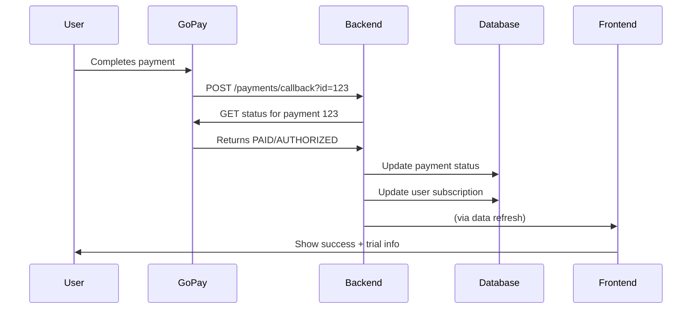

# Payment Integration - Production Checklist

## Frontend ✅ Complete

### API Integration

**Endpoint:** `POST /api/v1/payments/create`

**Request Format:**
```json
{
  "returnUrl": "https://primat-plus.com/predplatne/uspech?status=success",
  "paymentDetails": true,
  "paymentTerms": true,
  "gdpr": true
}
```

**Expected Response:**
```json
{
  "gateway_url": "https://gate.gopay.cz/...",
  "gopay_id": 123456789,
  "status": "PENDING"
}
```

### User Flow

1. **Free user visits** `/predplatne/checkout`
2. **Reviews GoPay terms** and plan details
3. **Checks 3 mandatory consents:**
   - ✅ Payment terms ([Terms of Service](https://www.primat.cz/podminky-uzivani))
   - ✅ Payment details storage (GoPay PCI-DSS Level 1)
   - ✅ GDPR consent ([Privacy Policy](https://www.primat.cz/ochrana-osobnich-udaju))
4. **Clicks "Proceed to Payment"** → Frontend calls `/payments/create`
5. **Frontend receives** `gateway_url` → Redirects user to GoPay
6. **User completes payment** at GoPay
7. **GoPay redirects back** to `returnUrl` with additional params
8. **User lands on** `/predplatne/uspech?status=success&id=123456789`
9. **Frontend refreshes data** and shows success
10. **Auto-redirects to** `/predplatne/sprava` after 3 seconds

---

## Backend Checklist

### ⚠️ CRITICAL - Production TODO

#### 1. Email Address
```php
// File: PaymentFacade.php, Line 119
'email' => 'test@test.cz', // ❌ CHANGE THIS TO REAL USER EMAIL
```

**Fix:**
```php
'email' => $user->getEmail(),
```

#### 2. Base URL Configuration
Ensure `BASE_URL` environment variable is set correctly:
- **Development:** `localhost:8000`
- **Production:** `api.primat-plus.com` (or your production domain)

#### 3. GoPay Webhook URL
```php
// File: PaymentFacade.php, Line 111
$notifyUrl = "http://" . $url . "/api/v1/payments/callback";
```

**Production must use HTTPS:**
```php
$notifyUrl = "https://" . $url . "/api/v1/payments/callback";
```

#### 4. Return URL Handling

The backend **already handles this correctly** ✅

Frontend sends:
```
returnUrl: "https://primat-plus.com/predplatne/uspech?status=success"
```

Backend passes it directly to GoPay:
```php
'return_url' => $returnUrl, // Line 132
```

GoPay appends its parameters:
```
https://primat-plus.com/predplatne/uspech?status=success&id=3287196081
```

Frontend ignores GoPay's params and uses only `status=success` ✅

---

## GoPay Compliance ✅ Complete

### Required Information (All Displayed)

1. ✅ **Reason for recurring payment:** "Platba za prémiové předplatné Primát Plus"
2. ✅ **Maximum amount:** Displayed from plan
3. ✅ **Fixed vs variable:** "Fixní částka"
4. ✅ **Billing period:** "Měsíčně" (14 days trial + monthly)
5. ✅ **Billing frequency:** After trial, monthly
6. ✅ **Fixed frequency:** Yes
7. ✅ **Contact for changes:** Support email in terms
8. ✅ **Cancellation info:** Link to terms + cancellation page
9. ✅ **Terms link:** https://www.primat.cz/podminky-uzivani
10. ✅ **Privacy link:** https://www.primat.cz/ochrana-osobnich-udaju

### Required Consents (3 Checkboxes)

1. ✅ **Payment Terms** - User agrees to recurring payment terms
2. ✅ **Payment Details Storage** - User agrees to GoPay storing card data (PCI-DSS Level 1)
3. ✅ **GDPR** - User agrees to personal data processing

All checkboxes **MUST** be checked before payment proceeds.

---

## Testing Instructions

### Local Testing (with Mock Backend)

Since webhooks won't work locally, you can:

1. **Start frontend:** `pnpm dev`
2. **Start backend:** `make up-dev`
3. **Create payment** → Get redirected to GoPay
4. **In GoPay test environment:** Complete payment
5. **Get redirected back** to success page
6. **Manually trigger webhook:**
   ```bash
   curl -X GET "http://localhost:8000/api/v1/payments/callback?id=YOUR_GOPAY_ID"
   ```

### Production Testing

The backend dev mentioned:
> "tak pak dej kdyztak vedet, bysme to mohli zkusit na produkci, protoze na lokalu uplne ty webhooky nepujdou"

**Recommended approach:**
1. Deploy to staging/production
2. Use GoPay test credentials
3. Complete end-to-end test
4. Verify webhook triggers automatically
5. Check subscription updates correctly

---

## Payment Lifecycle

### Trial Payment (First Time Users)

```
Amount: 1 CZK (test payment)
Type: RECURRING
Subscription: TRIAL (14 days)
Auto-renewal: ON
```

### Premium Payment (After Trial / Returning Users)

```
Amount: 19900 CZK (199 Kč)
Type: RECURRING
Subscription: PREMIUM (1 month)
Auto-renewal: ON
```

### Backend Updates User

**On successful payment (webhook):**
```php
// File: PaymentFacade.php, Line 175-180
if ($status === PaymentStatus::PAID || $status === PaymentStatus::AUTHORIZED) {
    $this->updateUserSubscription($payment);
}
```

**Trial users:**
- `subscriptionType` = TRIAL
- `subscriptionExpiresAt` = +14 days
- `hasUsedTrial` = true

**Premium users:**
- `subscriptionType` = PREMIUM
- `subscriptionExpiresAt` = +1 month

---

## Webhook Flow



---

## Cancel Subscription

**Endpoint:** `POST /api/v1/payments/cancel`

Frontend calls this from `/predplatne/sprava` when user clicks "Zrušit předplatné"

**Backend should:**
1. Disable auto-renewal with GoPay
2. Keep subscription active until `subscriptionExpiresAt`
3. Don't downgrade immediately
4. Return success

**Frontend shows:**
- Subscription remains active until expiry date
- No more charges will occur
- User can still use premium features until expiry

---

## Environment Variables Needed

### Production
```env
BASE_URL=api.primat-plus.com
GOPAY_GOID=<production_goid>
GOPAY_CLIENT_ID=<production_client_id>
GOPAY_CLIENT_SECRET=<production_client_secret>
GOPAY_IS_PRODUCTION=true
```

### Staging/Test
```env
BASE_URL=api.primat-plus-staging.com
GOPAY_GOID=<test_goid>
GOPAY_CLIENT_ID=<test_client_id>
GOPAY_CLIENT_SECRET=<test_client_secret>
GOPAY_IS_PRODUCTION=false
```

---

## Ready for Production? ✅

### Frontend
- [x] 3 consent checkboxes implemented
- [x] Correct API endpoint (`/payments/create`)
- [x] Correct request format
- [x] Links to terms and privacy policy
- [x] GoPay compliance information
- [x] Success/failure handling
- [x] Webhook data refresh
- [x] Auto-redirect after success

### Backend Required Changes
- [ ] Change email from `test@test.cz` to `$user->getEmail()`
- [ ] Verify `BASE_URL` env var is correct
- [ ] Change webhook URL from `http://` to `https://`
- [ ] Set production GoPay credentials
- [ ] Test complete flow on staging

### Post-Launch
- [ ] Monitor webhook delivery
- [ ] Monitor trial → premium conversions
- [ ] Monitor failed payments
- [ ] Set up alerts for payment failures

---

## Questions for Backend Dev

1. **Email:** Is user email available on `$user` object?
2. **HTTPS:** Will webhook URL use HTTPS in production?
3. **GoPay Credentials:** Are production credentials ready?
4. **Testing:** Can we test on staging first?
5. **Monitoring:** What logging/monitoring is in place for webhooks?

---

## Support Links

- **GoPay Documentation:** https://doc.gopay.com/
- **Terms of Service:** https://www.primat.cz/podminky-uzivani
- **Privacy Policy:** https://www.primat.cz/ochrana-osobnich-udaju
- **Frontend Checkout:** `/predplatne/checkout`
- **Success Page:** `/predplatne/uspech`
- **Management Page:** `/predplatne/sprava`

---

**Last Updated:** 2025-11-27  
**Status:** ✅ Frontend Complete | ⚠️ Backend Needs Minor Updates

